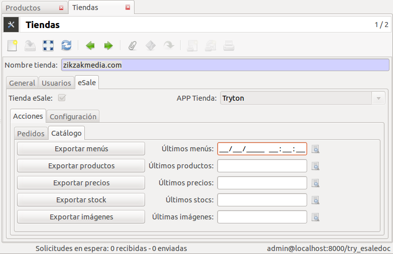
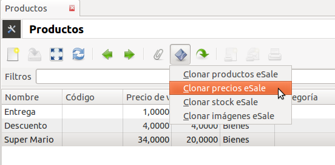

.. inheritref:: esale_product/esale_product:section:exportar

Exportar
--------

Cualquier alta o modificación del catálogo de productos de Tryton, se debe
exportar a la tienda externa (Magento, Prestashop,...)

.. note:: Tryton eSale almacena los productos en una tabla extra como cache. De
          esta forma, la consultas del canal eSale no cargan el servidor Tryton.
          Además tanto el ERP como el cliente eSale pueden estar en dos
          servidores/redes distintas.

.. inheritref:: esale_product/esale_product:section:por_tienda

Por tienda
----------

En la configuración de la tienda dispone de las acciones (botones) para
exportar/clonar los productos a la tienda.

* Exportar menús. Exporta todos los menús a partir de una fecha de creación o
  modificación a la tienda externa.
* Exportar productos. Exporta todos los productos a partir de una fecha de
  creación o modificación a la tienda externa.
* Exportar precios. Exporta todos los precios a partir de una fecha de creación
  o modificación según tarifa o precio venta de la tienda.
* Exporta stock. Exporta todos los stocks a partir de una fecha de creación o
  modificación. En el caso de Tryton eSale esta opción no es necesaria ya que
  los stocks se calculan en el instante.
* Exportar imágenes. Exporta todas las imágenes a partir de una fecha de
  creación o modificación.

.. inheritref:: esale_product/esale_product:section:por_producto

Por producto
------------

En el listado de productos, puede ejecutar una acción en un producto concreto o
seleccionar varios productos de la lista. Esta acción es cómoda si realiza
cambios de un producto concreto y desea sólo clonar o exportar ese producto.

